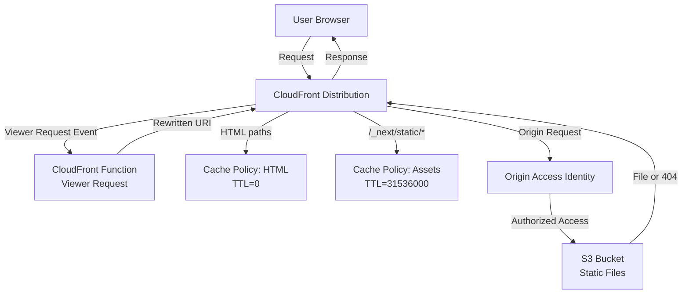

# Design Document: CloudFront Routing and Caching Fix

## Overview

This design addresses routing and caching issues in a Next.js static export deployment on AWS using S3 + CloudFront with Origin Access Identity (OAI). The solution involves:

1. Implementing a CloudFront Function for URI rewriting to handle static route resolution
2. Removing SPA-style error responses that mask real 404s
3. Configuring separate cache policies for HTML files (no cache) and versioned assets (1-year cache)
4. Updating deployment scripts to set appropriate Cache-Control headers
5. Adding idempotent profile creation to the Profile Lambda as a safety net
6. Documenting optional OAC migration path

The design prioritizes correctness, performance, and maintainability while working within AWS infrastructure constraints.

## Architecture

### Current Architecture Issues

```
User Request → CloudFront → S3 (OAI)
                    ↓
            CustomErrorResponses (403→200, 404→200)
                    ↓
            Always serves /index.html (WRONG)
```

Problems:
- All routes serve /index.html due to SPA-style error handling
- No URI rewriting for static routes
- HTML files cached for 1 day (DefaultTTL=86400)
- Real 404s masked as 200 responses

### Target Architecture

```
User Request → CloudFront Function (Viewer Request)
                    ↓
              URI Rewriting (/register → /register/index.html)
                    ↓
              Cache Lookup (with correct cache policy)
                    ↓
              S3 Origin (OAI) → Correct file or real 404
```

Benefits:
- Correct static route resolution
- HTML files never cached (TTL=0)
- Versioned assets cached for 1 year
- Real 404s returned for missing content
- No server-side logic required

### Component Diagram



## Components and Interfaces

### 1. CloudFront Function (Viewer Request)

**Purpose**: Rewrite URIs to resolve static routes to index.html files

**Input**: CloudFront event object with request.uri
**Output**: Modified request object with rewritten URI

**Logic**:
```javascript
function handler(event) {
  var request = event.request;
  var uri = request.uri;
  
  // Case 1: URI ends with "/" → append "index.html"
  if (uri.endsWith('/')) {
    request.uri = uri + 'index.html';
    return request;
  }
  
  // Case 2: URI has no extension → append "/index.html"
  if (!uri.includes('.')) {
    request.uri = uri + '/index.html';
    return request;
  }
  
  // Case 3: URI has extension → no modification
  return request;
}
```

**Examples**:
- `/` → `/index.html`
- `/register` → `/register/index.html`
- `/register/` → `/register/index.html`
- `/login` → `/login/index.html`
- `/favicon.ico` → `/favicon.ico` (unchanged)
- `/_next/static/chunk.js` → `/_next/static/chunk.js` (unchanged)

### 2. CloudFront Cache Policies

#### HTML Cache Policy

**Purpose**: Prevent CloudFront from caching HTML files

**Configuration**:
```json
{
  "MinTTL": 0,
  "DefaultTTL": 0,
  "MaxTTL": 0,
  "ParametersInCacheKeyAndForwardedToOrigin": {
    "EnableAcceptEncodingGzip": true,
    "EnableAcceptEncodingBrotli": true,
    "HeadersConfig": {
      "HeaderBehavior": "none"
    },
    "CookiesConfig": {
      "CookieBehavior": "none"
    },
    "QueryStringsConfig": {
      "QueryStringBehavior": "none"
    }
  }
}
```

**Applied to**: Default cache behavior (all HTML files)

#### Versioned Assets Cache Policy

**Purpose**: Aggressively cache immutable versioned assets

**Configuration**:
```json
{
  "MinTTL": 0,
  "DefaultTTL": 31536000,
  "MaxTTL": 31536000,
  "ParametersInCacheKeyAndForwardedToOrigin": {
    "EnableAcceptEncodingGzip": true,
    "EnableAcceptEncodingBrotli": true,
    "HeadersConfig": {
      "HeaderBehavior": "none"
    },
    "CookiesConfig": {
      "CookieBehavior": "none"
    },
    "QueryStringsConfig": {
      "QueryStringBehavior": "none"
    }
  }
}
```

**Applied to**: Path pattern `/_next/static/*`

**Alternative**: Use AWS Managed-CachingOptimized policy if available

### 3. CloudFront Distribution Configuration

**Default Cache Behavior**:
- Target Origin: S3 bucket via OAI
- Viewer Protocol Policy: Redirect HTTP to HTTPS
- Allowed Methods: GET, HEAD, OPTIONS
- Cache Policy: HTML Cache Policy (TTL=0)
- Function Associations: Viewer Request → CloudFront Function
- Compress Objects: Yes

**Ordered Cache Behaviors**:
1. Path Pattern: `/_next/static/*`
   - Cache Policy: Versioned Assets Cache Policy (TTL=31536000)
   - Function Associations: Viewer Request → CloudFront Function
   - Compress Objects: Yes

**Custom Error Responses**: REMOVED (no SPA-style error handling)

### 4. S3 Bucket Configuration

**Purpose**: Store static files with appropriate cache headers

**Bucket Policy**: Restrict access to CloudFront OAI only

**File Upload Strategy**:

**HTML Files** (*.html, *.json):
```bash
aws s3 sync out/ s3://bucket-name/ \
  --cache-control "no-cache, max-age=0, must-revalidate" \
  --exclude "*" \
  --include "*.html" \
  --include "*.json"
```

**Versioned Assets** (/_next/static/*):
```bash
aws s3 sync out/ s3://bucket-name/ \
  --cache-control "public, max-age=31536000, immutable" \
  --exclude "*.html" \
  --exclude "*.json"
```

### 5. Profile Lambda Enhancement

**Purpose**: Provide idempotent profile creation as safety net

**Current Behavior**:
- GET /profile → Returns profile or 404 if not found

**Enhanced Behavior**:
- GET /profile → Returns profile OR creates default profile if not found

**Implementation**:

```python
import boto3
import json
import os
from botocore.exceptions import ClientError

dynamodb = boto3.resource('dynamodb')
table = dynamodb.Table(os.environ['DYNAMODB_TABLE'])

def lambda_handler(event, context):
    # Extract userId from Cognito authorizer
    user_id = event['requestContext']['authorizer']['claims']['sub']
    email = event['requestContext']['authorizer']['claims']['email']
    name = event['requestContext']['authorizer']['claims'].get('name', email)
    
    if event['httpMethod'] == 'GET':
        try:
            # Try to get existing profile
            response = table.get_item(Key={'userId': user_id})
            
            if 'Item' in response:
                return {
                    'statusCode': 200,
                    'headers': {
                        'Content-Type': 'application/json',
                        'Access-Control-Allow-Origin': '*'
                    },
                    'body': json.dumps(response['Item'])
                }
            else:
                # Profile doesn't exist, create default profile
                default_profile = {
                    'userId': user_id,
                    'email': email,
                    'name': name,
                    'phone': '',
                    'company': ''
                }
                
                # Idempotent put - only create if doesn't exist
                try:
                    table.put_item(
                        Item=default_profile,
                        ConditionExpression='attribute_not_exists(userId)'
                    )
                except ClientError as e:
                    if e.response['Error']['Code'] == 'ConditionalCheckFailedException':
                        # Profile was created by another request, fetch it
                        response = table.get_item(Key={'userId': user_id})
                        return {
                            'statusCode': 200,
                            'headers': {
                                'Content-Type': 'application/json',
                                'Access-Control-Allow-Origin': '*'
                            },
                            'body': json.dumps(response['Item'])
                        }
                    raise
                
                return {
                    'statusCode': 200,
                    'headers': {
                        'Content-Type': 'application/json',
                        'Access-Control-Allow-Origin': '*'
                    },
                    'body': json.dumps(default_profile)
                }
                
        except Exception as e:
            return {
                'statusCode': 500,
                'headers': {
                    'Content-Type': 'application/json',
                    'Access-Control-Allow-Origin': '*'
                },
                'body': json.dumps({'error': str(e)})
            }
    
    # Handle PUT for profile updates
    elif event['httpMethod'] == 'PUT':
        # ... existing PUT logic ...
        pass
```

**Key Features**:
- Idempotent: Multiple concurrent requests won't create duplicates
- Uses ConditionExpression to prevent race conditions
- Extracts user info from Cognito JWT claims
- Falls back to fetching if concurrent creation detected

## Data Models

### CloudFront Function Event

```typescript
interface CloudFrontEvent {
  request: {
    uri: string;
    method: string;
    querystring: string;
    headers: Record<string, Array<{key: string; value: string}>>;
  };
}
```

### S3 Object Metadata

```typescript
interface S3ObjectMetadata {
  Key: string;                    // Object path in bucket
  CacheControl: string;           // Cache-Control header
  ContentType: string;            // MIME type
  ContentEncoding?: string;       // gzip, br, etc.
}
```

**HTML Files**:
```typescript
{
  Key: "register/index.html",
  CacheControl: "no-cache, max-age=0, must-revalidate",
  ContentType: "text/html; charset=utf-8"
}
```

**Versioned Assets**:
```typescript
{
  Key: "_next/static/chunks/main-abc123.js",
  CacheControl: "public, max-age=31536000, immutable",
  ContentType: "application/javascript"
}
```

### DynamoDB Profile Schema

```typescript
interface UserProfile {
  userId: string;      // Partition key (Cognito sub)
  email: string;       // User email from Cognito
  name: string;        // User name from Cognito
  phone: string;       // User-provided phone
  company: string;     // User-provided company
}
```

## Correctness Properties

*A property is a characteristic or behavior that should hold true across all valid executions of a system—essentially, a formal statement about what the system should do. Properties serve as the bridge between human-readable specifications and machine-verifiable correctness guarantees.*


### Property 1: URI Rewriting Correctness

*For any* valid URI path, the CloudFront Function should rewrite it according to these rules: paths ending with "/" get "index.html" appended, paths without extensions and without trailing slash get "/index.html" appended, and paths with file extensions remain unchanged.

**Validates: Requirements 1.1, 1.2, 1.4**

### Property 2: HTML and JSON Cache-Control Headers

*For any* HTML or JSON file uploaded to S3 by the deployment script, the file should have Cache-Control header set to "no-cache, max-age=0, must-revalidate".

**Validates: Requirements 3.1, 7.3**

### Property 3: Versioned Assets Cache-Control Headers

*For any* file matching the pattern /_next/static/* uploaded to S3 by the deployment script, the file should have Cache-Control header set to "public, max-age=31536000, immutable".

**Validates: Requirements 4.1**

### Property 4: Profile Lambda Idempotent Upsert

*For any* GET request to a non-existent profile, the Profile Lambda should create a default profile and return it, and if multiple concurrent requests attempt to create the same profile, exactly one profile should be created and all requests should receive the same profile data.

**Validates: Requirements 9.1, 9.3**

### Property 5: Profile Lambda Token Extraction

*For any* valid Cognito JWT token, the Profile Lambda should correctly extract the email and name claims and use them when creating a default profile.

**Validates: Requirements 9.4**

## Error Handling

### CloudFront Function Errors

**Scenario**: CloudFront Function execution fails
- **Handling**: CloudFront will serve the request without URI rewriting
- **Impact**: Routes may not resolve correctly
- **Mitigation**: Keep function code simple and well-tested; CloudFront Functions have built-in monitoring

### S3 Origin Errors

**Scenario**: S3 returns 403 (access denied) or 404 (not found)
- **Handling**: CloudFront returns 404 to user (no CustomErrorResponses)
- **Impact**: User sees appropriate error page
- **Mitigation**: Ensure all required files are deployed; monitor 404 rates

### Cache Invalidation Errors

**Scenario**: CloudFront invalidation fails or times out
- **Handling**: Deployment script reports error and exits with non-zero status
- **Impact**: Old cached content may be served until TTL expires
- **Mitigation**: Retry invalidation; for HTML files with TTL=0, impact is minimal

### Profile Lambda Errors

**Scenario**: DynamoDB is unavailable or throttled
- **Handling**: Lambda returns 500 error with error message
- **Impact**: User cannot access profile temporarily
- **Mitigation**: Use DynamoDB on-demand pricing for auto-scaling; implement exponential backoff in client

**Scenario**: Concurrent profile creation attempts
- **Handling**: ConditionExpression prevents duplicates; ConditionalCheckFailedException is caught and ignored
- **Impact**: No duplicates created; all requests succeed
- **Mitigation**: Idempotent design handles race conditions gracefully

**Scenario**: Cognito token missing required claims
- **Handling**: Lambda uses email as fallback for name; returns error if email is missing
- **Impact**: Profile may have incomplete data
- **Mitigation**: Validate token structure; require email claim in Cognito configuration

### Deployment Script Errors

**Scenario**: AWS CLI command fails (network, permissions, etc.)
- **Handling**: Script exits with non-zero status and error message
- **Impact**: Deployment is incomplete
- **Mitigation**: Verify AWS credentials and permissions before deployment; use --dry-run flag for testing

**Scenario**: S3 bucket doesn't exist
- **Handling**: aws s3 sync fails with NoSuchBucket error
- **Impact**: Deployment fails
- **Mitigation**: Verify bucket name; create bucket if needed

## Testing Strategy

### Dual Testing Approach

This feature requires both unit tests and property-based tests for comprehensive coverage:

**Unit Tests**: Focus on specific examples, edge cases, and configuration verification
- CloudFront configuration validation (cache policies, function association)
- Deployment script execution on Windows
- Specific URI rewriting examples (/, /register, /favicon.ico)
- Profile Lambda error handling scenarios

**Property-Based Tests**: Verify universal properties across all inputs
- URI rewriting correctness across random valid paths
- Cache-Control headers for random file sets
- Profile Lambda idempotency with concurrent requests
- Token extraction with random valid JWT tokens

### Property-Based Testing Configuration

**Library Selection**:
- **JavaScript/TypeScript**: Use `fast-check` for CloudFront Function tests
- **Python**: Use `hypothesis` for Profile Lambda tests
- **Bash/PowerShell**: Use manual property verification scripts for deployment tests

**Test Configuration**:
- Minimum 100 iterations per property test
- Each test tagged with: **Feature: cloudfront-routing-fix, Property {number}: {property_text}**

### Test Implementation Plan

#### 1. CloudFront Function Tests

**Unit Tests**:
```typescript
// test/cloudfront-function.test.ts
describe('CloudFront Function URI Rewriting', () => {
  test('root path returns /index.html', () => {
    const event = { request: { uri: '/' } };
    const result = handler(event);
    expect(result.request.uri).toBe('/index.html');
  });
  
  test('path with trailing slash appends index.html', () => {
    const event = { request: { uri: '/register/' } };
    const result = handler(event);
    expect(result.request.uri).toBe('/register/index.html');
  });
  
  test('path without extension appends /index.html', () => {
    const event = { request: { uri: '/login' } };
    const result = handler(event);
    expect(result.request.uri).toBe('/login/index.html');
  });
  
  test('path with extension remains unchanged', () => {
    const event = { request: { uri: '/favicon.ico' } };
    const result = handler(event);
    expect(result.request.uri).toBe('/favicon.ico');
  });
});
```

**Property Test**:
```typescript
// test/cloudfront-function.property.test.ts
import fc from 'fast-check';

// Feature: cloudfront-routing-fix, Property 1: URI Rewriting Correctness
describe('Property: URI Rewriting Correctness', () => {
  test('URI rewriting follows correct rules for all valid paths', () => {
    fc.assert(
      fc.property(
        fc.oneof(
          // Generate paths with trailing slash
          fc.array(fc.stringOf(fc.constantFrom('a-z', '0-9', '-')), { minLength: 1 })
            .map(parts => '/' + parts.join('/') + '/'),
          // Generate paths without extension
          fc.array(fc.stringOf(fc.constantFrom('a-z', '0-9', '-')), { minLength: 1 })
            .map(parts => '/' + parts.join('/')),
          // Generate paths with extension
          fc.tuple(
            fc.array(fc.stringOf(fc.constantFrom('a-z', '0-9', '-')), { minLength: 1 }),
            fc.constantFrom('js', 'css', 'ico', 'png', 'jpg')
          ).map(([parts, ext]) => '/' + parts.join('/') + '.' + ext)
        ),
        (uri) => {
          const event = { request: { uri } };
          const result = handler(event);
          
          if (uri.endsWith('/')) {
            // Should append index.html
            expect(result.request.uri).toBe(uri + 'index.html');
          } else if (!uri.includes('.')) {
            // Should append /index.html
            expect(result.request.uri).toBe(uri + '/index.html');
          } else {
            // Should remain unchanged
            expect(result.request.uri).toBe(uri);
          }
        }
      ),
      { numRuns: 100 }
    );
  });
});
```

#### 2. Deployment Script Tests

**Unit Tests**:
```powershell
# test/deployment.test.ps1
Describe "Deployment Script" {
  It "runs successfully on Windows" {
    # Test that script executes without errors
    $result = & .\deploy.ps1 -DryRun
    $LASTEXITCODE | Should -Be 0
  }
  
  It "creates invalidation after upload" {
    # Mock AWS CLI and verify invalidation is called
    Mock aws { return "INVALIDATION_ID" } -ParameterFilter { $args[0] -eq "cloudfront" }
    & .\deploy.ps1
    Assert-MockCalled aws -ParameterFilter { $args[2] -eq "create-invalidation" }
  }
}
```

**Property Test** (manual verification script):
```powershell
# test/verify-cache-headers.ps1
# Feature: cloudfront-routing-fix, Property 2: HTML and JSON Cache-Control Headers
# Feature: cloudfront-routing-fix, Property 3: Versioned Assets Cache-Control Headers

$bucket = "polizalab-crm-frontend"

# Get all objects from bucket
$objects = aws s3api list-objects-v2 --bucket $bucket --query "Contents[].Key" --output json | ConvertFrom-Json

$failures = @()

foreach ($key in $objects) {
  $metadata = aws s3api head-object --bucket $bucket --key $key 2>$null
  
  if ($metadata) {
    $cacheControl = ($metadata | ConvertFrom-Json).CacheControl
    
    # Check HTML and JSON files
    if ($key -match '\.(html|json)$') {
      if ($cacheControl -ne "no-cache, max-age=0, must-revalidate") {
        $failures += "FAIL: $key has Cache-Control: $cacheControl (expected: no-cache, max-age=0, must-revalidate)"
      }
    }
    
    # Check versioned assets
    if ($key -match '^_next/static/') {
      if ($cacheControl -ne "public, max-age=31536000, immutable") {
        $failures += "FAIL: $key has Cache-Control: $cacheControl (expected: public, max-age=31536000, immutable)"
      }
    }
  }
}

if ($failures.Count -eq 0) {
  Write-Host "✓ All files have correct Cache-Control headers" -ForegroundColor Green
  exit 0
} else {
  $failures | ForEach-Object { Write-Host $_ -ForegroundColor Red }
  exit 1
}
```

#### 3. Profile Lambda Tests

**Unit Tests**:
```python
# test/test_profile_handler.py
import pytest
from moto import mock_dynamodb
import boto3
from profile_handler import lambda_handler

@mock_dynamodb
def test_get_existing_profile():
    # Setup DynamoDB table
    dynamodb = boto3.resource('dynamodb', region_name='us-east-1')
    table = dynamodb.create_table(
        TableName='profiles',
        KeySchema=[{'AttributeName': 'userId', 'KeyType': 'HASH'}],
        AttributeDefinitions=[{'AttributeName': 'userId', 'AttributeType': 'S'}]
    )
    
    # Insert existing profile
    table.put_item(Item={'userId': 'user123', 'email': 'test@example.com', 'name': 'Test User'})
    
    # Test GET request
    event = {
        'httpMethod': 'GET',
        'requestContext': {
            'authorizer': {
                'claims': {
                    'sub': 'user123',
                    'email': 'test@example.com',
                    'name': 'Test User'
                }
            }
        }
    }
    
    response = lambda_handler(event, None)
    assert response['statusCode'] == 200
    assert 'user123' in response['body']

@mock_dynamodb
def test_get_nonexistent_profile_creates_default():
    # Setup DynamoDB table
    dynamodb = boto3.resource('dynamodb', region_name='us-east-1')
    table = dynamodb.create_table(
        TableName='profiles',
        KeySchema=[{'AttributeName': 'userId', 'KeyType': 'HASH'}],
        AttributeDefinitions=[{'AttributeName': 'userId', 'AttributeType': 'S'}]
    )
    
    # Test GET request for non-existent profile
    event = {
        'httpMethod': 'GET',
        'requestContext': {
            'authorizer': {
                'claims': {
                    'sub': 'newuser',
                    'email': 'new@example.com',
                    'name': 'New User'
                }
            }
        }
    }
    
    response = lambda_handler(event, None)
    assert response['statusCode'] == 200
    
    # Verify profile was created
    item = table.get_item(Key={'userId': 'newuser'})
    assert 'Item' in item
    assert item['Item']['email'] == 'new@example.com'
```

**Property Tests**:
```python
# test/test_profile_handler_properties.py
from hypothesis import given, strategies as st
import pytest
from moto import mock_dynamodb
import boto3
from concurrent.futures import ThreadPoolExecutor
from profile_handler import lambda_handler

# Feature: cloudfront-routing-fix, Property 4: Profile Lambda Idempotent Upsert
@mock_dynamodb
@given(
    user_id=st.text(min_size=1, max_size=50, alphabet=st.characters(whitelist_categories=('Lu', 'Ll', 'Nd'))),
    email=st.emails(),
    name=st.text(min_size=1, max_size=100)
)
def test_concurrent_profile_creation_is_idempotent(user_id, email, name):
    """Property: Concurrent GET requests for non-existent profile create exactly one profile"""
    
    # Setup DynamoDB table
    dynamodb = boto3.resource('dynamodb', region_name='us-east-1')
    table = dynamodb.create_table(
        TableName='profiles',
        KeySchema=[{'AttributeName': 'userId', 'KeyType': 'HASH'}],
        AttributeDefinitions=[{'AttributeName': 'userId', 'AttributeType': 'S'}]
    )
    
    event = {
        'httpMethod': 'GET',
        'requestContext': {
            'authorizer': {
                'claims': {
                    'sub': user_id,
                    'email': email,
                    'name': name
                }
            }
        }
    }
    
    # Simulate 10 concurrent requests
    with ThreadPoolExecutor(max_workers=10) as executor:
        futures = [executor.submit(lambda_handler, event, None) for _ in range(10)]
        responses = [f.result() for f in futures]
    
    # All requests should succeed
    assert all(r['statusCode'] == 200 for r in responses)
    
    # Verify exactly one profile exists
    items = table.scan()['Items']
    assert len(items) == 1
    assert items[0]['userId'] == user_id
    assert items[0]['email'] == email
    assert items[0]['name'] == name

# Feature: cloudfront-routing-fix, Property 5: Profile Lambda Token Extraction
@given(
    user_id=st.text(min_size=1, max_size=50),
    email=st.emails(),
    name=st.text(min_size=1, max_size=100)
)
def test_token_claims_extracted_correctly(user_id, email, name):
    """Property: Lambda correctly extracts email and name from any valid JWT token claims"""
    
    event = {
        'httpMethod': 'GET',
        'requestContext': {
            'authorizer': {
                'claims': {
                    'sub': user_id,
                    'email': email,
                    'name': name
                }
            }
        }
    }
    
    # Extract claims (simulate lambda logic)
    extracted_user_id = event['requestContext']['authorizer']['claims']['sub']
    extracted_email = event['requestContext']['authorizer']['claims']['email']
    extracted_name = event['requestContext']['authorizer']['claims'].get('name', email)
    
    # Verify extraction
    assert extracted_user_id == user_id
    assert extracted_email == email
    assert extracted_name == name
```

#### 4. Integration Tests

**CloudFront Configuration Verification**:
```bash
#!/bin/bash
# test/verify-cloudfront-config.sh

DISTRIBUTION_ID="E1WB95BQGR0YAT"

echo "Verifying CloudFront configuration..."

# Get distribution config
CONFIG=$(aws cloudfront get-distribution-config --id $DISTRIBUTION_ID)

# Verify no CustomErrorResponses for 404
ERROR_RESPONSES=$(echo $CONFIG | jq '.DistributionConfig.CustomErrorResponses.Items | length')
if [ "$ERROR_RESPONSES" -eq 0 ]; then
  echo "✓ No CustomErrorResponses configured (correct)"
else
  echo "✗ CustomErrorResponses found (should be removed)"
  exit 1
fi

# Verify function association
FUNCTION_ARN=$(echo $CONFIG | jq -r '.DistributionConfig.DefaultCacheBehavior.FunctionAssociations.Items[0].FunctionARN')
if [ -n "$FUNCTION_ARN" ]; then
  echo "✓ CloudFront Function associated: $FUNCTION_ARN"
else
  echo "✗ No CloudFront Function associated"
  exit 1
fi

# Verify cache behavior for /_next/static/*
STATIC_BEHAVIOR=$(echo $CONFIG | jq '.DistributionConfig.CacheBehaviors.Items[] | select(.PathPattern == "/_next/static/*")')
if [ -n "$STATIC_BEHAVIOR" ]; then
  echo "✓ Cache behavior configured for /_next/static/*"
else
  echo "✗ No cache behavior for /_next/static/*"
  exit 1
fi

echo "✓ All CloudFront configuration checks passed"
```

**End-to-End Routing Test**:
```bash
#!/bin/bash
# test/e2e-routing-test.sh

DOMAIN="https://crm.antesdefirmar.org"

echo "Testing end-to-end routing..."

# Test root path
RESPONSE=$(curl -s -o /dev/null -w "%{http_code}" $DOMAIN/)
if [ "$RESPONSE" -eq 200 ]; then
  echo "✓ Root path (/) returns 200"
else
  echo "✗ Root path (/) returns $RESPONSE"
  exit 1
fi

# Test /register
RESPONSE=$(curl -s -o /dev/null -w "%{http_code}" $DOMAIN/register)
if [ "$RESPONSE" -eq 200 ]; then
  echo "✓ /register returns 200"
else
  echo "✗ /register returns $RESPONSE"
  exit 1
fi

# Test /register/
RESPONSE=$(curl -s -o /dev/null -w "%{http_code}" $DOMAIN/register/)
if [ "$RESPONSE" -eq 200 ]; then
  echo "✓ /register/ returns 200"
else
  echo "✗ /register/ returns $RESPONSE"
  exit 1
fi

# Test non-existent path returns 404
RESPONSE=$(curl -s -o /dev/null -w "%{http_code}" $DOMAIN/nonexistent)
if [ "$RESPONSE" -eq 404 ]; then
  echo "✓ Non-existent path returns 404"
else
  echo "✗ Non-existent path returns $RESPONSE (expected 404)"
  exit 1
fi

# Verify /register content is correct (not home page)
CONTENT=$(curl -s $DOMAIN/register)
if echo "$CONTENT" | grep -q "register"; then
  echo "✓ /register serves correct content"
else
  echo "✗ /register serves incorrect content (possibly home page)"
  exit 1
fi

echo "✓ All end-to-end routing tests passed"
```

### Test Execution Order

1. **Unit tests first**: Verify individual components work correctly
2. **Property tests**: Verify universal properties across random inputs
3. **Configuration verification**: Ensure AWS resources configured correctly
4. **Integration tests**: Verify end-to-end behavior in deployed environment

### Success Criteria

All tests must pass before considering the feature complete:
- CloudFront Function unit tests: 100% pass
- CloudFront Function property test: 100 iterations pass
- Deployment script tests: All pass on Windows
- Cache-Control header verification: All files have correct headers
- Profile Lambda unit tests: 100% pass
- Profile Lambda property tests: 100 iterations pass each
- CloudFront configuration verification: All checks pass
- End-to-end routing tests: All routes return correct content

## Implementation Notes

### AWS CLI Commands Reference

**Create CloudFront Function**:
```bash
aws cloudfront create-function \
  --name uri-rewrite-function \
  --function-config Comment="Rewrite URIs for static site routing",Runtime=cloudfront-js-1.0 \
  --function-code fileb://function.js
```

**Publish CloudFront Function**:
```bash
aws cloudfront publish-function \
  --name uri-rewrite-function \
  --if-match ETAG_FROM_CREATE
```

**Create Cache Policy (HTML - No Cache)**:
```bash
aws cloudfront create-cache-policy \
  --cache-policy-config file://cache-policy-html.json
```

**Create Cache Policy (Versioned Assets)**:
```bash
aws cloudfront create-cache-policy \
  --cache-policy-config file://cache-policy-assets.json
```

**Update CloudFront Distribution**:
```bash
# Get current config
aws cloudfront get-distribution-config \
  --id E1WB95BQGR0YAT \
  --output json > dist-config.json

# Edit dist-config.json to:
# 1. Remove CustomErrorResponses
# 2. Add FunctionAssociations to DefaultCacheBehavior
# 3. Add CacheBehavior for /_next/static/*
# 4. Update CachePolicyId references

# Update distribution
aws cloudfront update-distribution \
  --id E1WB95BQGR0YAT \
  --if-match ETAG_FROM_GET \
  --distribution-config file://dist-config-updated.json
```

**Deploy to S3 with Correct Headers**:
```bash
# Upload versioned assets
aws s3 sync out/ s3://polizalab-crm-frontend/ \
  --cache-control "public, max-age=31536000, immutable" \
  --exclude "*.html" \
  --exclude "*.json"

# Upload HTML and JSON files
aws s3 sync out/ s3://polizalab-crm-frontend/ \
  --cache-control "no-cache, max-age=0, must-revalidate" \
  --exclude "*" \
  --include "*.html" \
  --include "*.json"
```

**Create Cache Invalidation**:
```bash
aws cloudfront create-invalidation \
  --distribution-id E1WB95BQGR0YAT \
  --paths "/*"
```

**Update Profile Lambda**:
```bash
# Package lambda
cd lambda-deploy
zip profile_handler.zip profile_handler.py

# Update function code
aws lambda update-function-code \
  --function-name profile-handler \
  --zip-file fileb://profile_handler.zip

# Wait for update to complete
aws lambda wait function-updated \
  --function-name profile-handler
```

### Rollback Plan

If issues occur after deployment:

1. **Revert CloudFront Function**: Unpublish function or update distribution to remove association
2. **Restore CustomErrorResponses**: Update distribution config to add back SPA-style error handling (temporary)
3. **Invalidate Cache**: Create invalidation for /* to clear any bad cached responses
4. **Revert Lambda**: Update function code to previous version
5. **Verify**: Run end-to-end tests to confirm rollback successful

### Monitoring and Validation

**CloudFront Metrics to Monitor**:
- 4xx Error Rate: Should remain low; spike indicates routing issues
- 5xx Error Rate: Should remain near zero
- Cache Hit Rate: Should be high for /_next/static/*, low for HTML
- Origin Latency: Should remain consistent

**Lambda Metrics to Monitor**:
- Invocation Count: Should match profile page visits
- Error Count: Should remain near zero
- Duration: Should be under 100ms for GET requests
- Concurrent Executions: Monitor for throttling

**Validation Steps Post-Deployment**:
1. Visit each route directly: /, /register, /login, /profile
2. Verify correct content loads (not home page)
3. Check browser DevTools Network tab for correct Cache-Control headers
4. Test non-existent route returns 404
5. Test profile creation for new user
6. Monitor CloudWatch Logs for errors

## OAC Migration Guide (Optional)

### Why Migrate from OAI to OAC?

**Origin Access Identity (OAI)** is the legacy method for restricting S3 bucket access to CloudFront. **Origin Access Control (OAC)** is the modern replacement with additional benefits:

- **Better security**: Uses AWS Signature Version 4 (SigV4) for all requests
- **More features**: Supports S3 server-side encryption with AWS KMS
- **Future-proof**: AWS recommends OAC for all new distributions
- **Same functionality**: OAI continues to work; migration is optional

### Migration Steps

#### 1. Create Origin Access Control

```bash
# Create OAC
aws cloudfront create-origin-access-control \
  --origin-access-control-config \
  Name=polizalab-crm-oac,\
Description="OAC for PolizaLab CRM",\
SigningProtocol=sigv4,\
SigningBehavior=always,\
OriginAccessControlOriginType=s3
```

Save the OAC ID from the response.

#### 2. Update S3 Bucket Policy

Replace the OAI-based policy with OAC-based policy:

```json
{
  "Version": "2012-10-17",
  "Statement": [
    {
      "Sid": "AllowCloudFrontServicePrincipal",
      "Effect": "Allow",
      "Principal": {
        "Service": "cloudfront.amazonaws.com"
      },
      "Action": "s3:GetObject",
      "Resource": "arn:aws:s3:::polizalab-crm-frontend/*",
      "Condition": {
        "StringEquals": {
          "AWS:SourceArn": "arn:aws:cloudfront::ACCOUNT_ID:distribution/E1WB95BQGR0YAT"
        }
      }
    }
  ]
}
```

Apply the policy:
```bash
aws s3api put-bucket-policy \
  --bucket polizalab-crm-frontend \
  --policy file://bucket-policy-oac.json
```

#### 3. Update CloudFront Distribution

```bash
# Get current config
aws cloudfront get-distribution-config \
  --id E1WB95BQGR0YAT \
  --output json > dist-config.json

# Edit dist-config.json:
# In Origins[0], replace:
#   "S3OriginConfig": {
#     "OriginAccessIdentity": "origin-access-identity/cloudfront/XXXXX"
#   }
# With:
#   "OriginAccessControlId": "OAC_ID_FROM_STEP_1"

# Update distribution
aws cloudfront update-distribution \
  --id E1WB95BQGR0YAT \
  --if-match ETAG_FROM_GET \
  --distribution-config file://dist-config-updated.json
```

#### 4. Verify and Clean Up

```bash
# Test that site still works
curl -I https://crm.antesdefirmar.org/

# If successful, delete old OAI (optional)
aws cloudfront delete-cloud-front-origin-access-identity \
  --id OLD_OAI_ID \
  --if-match ETAG
```

### Rollback

If issues occur, revert the CloudFront distribution config to use OAI and restore the original S3 bucket policy.

## Summary

This design provides a comprehensive solution for fixing CloudFront routing and caching issues in a Next.js static export deployment. The key components are:

1. **CloudFront Function** for URI rewriting (handles static route resolution)
2. **Separate cache policies** for HTML (no cache) and versioned assets (1-year cache)
3. **Deployment script updates** to set correct Cache-Control headers
4. **Profile Lambda enhancement** for idempotent profile creation
5. **Comprehensive testing strategy** with both unit and property-based tests

The solution maintains security with OAI (with optional OAC migration path), ensures correct routing behavior, optimizes caching for performance, and provides robust error handling.
