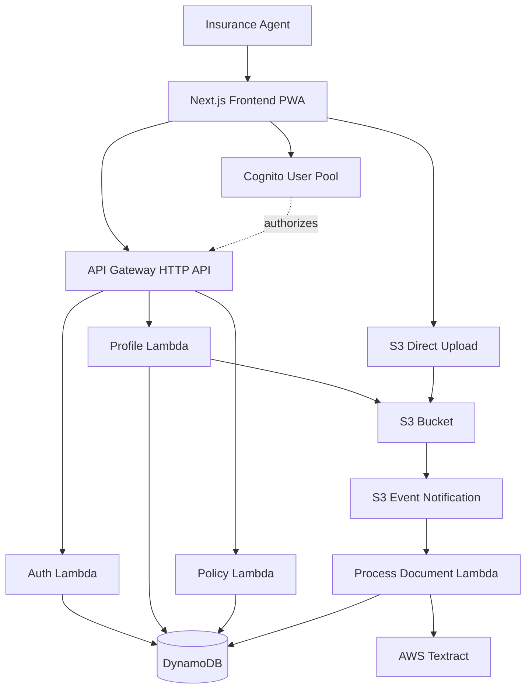

# Design Document - PolizaLab MVP

## Overview

PolizaLab MVP is a serverless, mobile-first web application designed for insurance agents in Mexico. The architecture follows a modern JAMstack approach with a React/Next.js frontend and AWS serverless backend services.

### Key Design Principles

1. **Mobile-First**: All UI components prioritize mobile experience with large touch targets and simple navigation
2. **Serverless Architecture**: Leverage AWS managed services to minimize operational overhead
3. **Simple Processing**: Use basic text extraction and regex parsing - no complex NLP or AI
4. **Event-Driven**: S3 upload events trigger automatic document processing
5. **Security by Default**: Cognito authentication with per-user data isolation

### Technology Stack

**Frontend:**
- React 18+ with Next.js 14 (App Router)
- Progressive Web App (PWA) capabilities
- Mobile-first responsive design
- Tailwind CSS for styling

**Backend:**
- AWS Lambda (Node.js 18+)
- API Gateway (HTTP API)
- DynamoDB (NoSQL database)
- S3 (document storage)
- AWS Textract (document text extraction)
- Amazon Cognito (authentication)

**Deployment:**
- Single environment (dev)
- Manual AWS Console/CLI setup (no IaC in MVP phase)

## Architecture

### High-Level Architecture



### Request Flow Patterns

**Authentication Flow:**
1. User submits credentials to Next.js frontend
2. Frontend calls Cognito API directly (AWS Amplify or SDK)
3. Cognito returns JWT tokens
4. Frontend stores tokens in secure storage
5. Subsequent API requests include JWT in Authorization header

**Policy Upload Flow:**
1. User selects document file in frontend
2. Frontend requests pre-signed S3 URL from API
3. Frontend uploads file directly to S3 using pre-signed URL
4. S3 triggers Lambda function via event notification
5. Lambda invokes Textract to analyze document
6. Lambda parses extracted text using regex/keywords
7. Lambda saves policy record to DynamoDB
8. Frontend polls or receives notification of processing completion

**Policy Retrieval Flow:**
1. User requests policies (home screen or renewals view)
2. Frontend calls API Gateway with JWT token
3. API Gateway validates token with Cognito
4. Lambda queries DynamoDB using userId from JWT
5. Lambda calculates renewal status for each policy
6. Lambda returns filtered and sorted policies
7. Frontend renders policies in mobile-optimized UI

## Components and Interfaces

### Frontend Components

#### 1. Authentication Module
**Responsibility:** Handle user registration, login, and session management

**Key Functions:**
- `registerUser(email, password)` - Register new user with Cognito
- `loginUser(email, password)` - Authenticate user and obtain tokens
- `logoutUser()` - Clear session and tokens
- `getCurrentUser()` - Get authenticated user info from token

**Dependencies:** AWS Cognito SDK, secure token storage

#### 2. Profile Manager
**Responsibility:** Manage user profile data and profile image uploads

**Key Functions:**
- `getProfile()` - Fetch user profile from API
- `updateProfile(nombre, apellido)` - Update user profile fields
- `uploadProfileImage(file)` - Upload image to S3 and update profile
- `getProfileImageUrl(s3Key)` - Generate signed URL for profile image

**Dependencies:** API client, S3 upload utilities

#### 3. Policy Upload Component
**Responsibility:** Handle document selection and upload to S3

**Key Functions:**
- `selectDocument()` - Open file picker for supported formats
- `validateFile(file)` - Check file type and size
- `requestUploadUrl(fileName, fileType)` - Get pre-signed S3 URL from API
- `uploadToS3(file, presignedUrl)` - Upload file directly to S3
- `notifyUploadComplete(s3Key)` - Notify backend of successful upload

**Dependencies:** File API, S3 upload utilities

#### 4. Policy List Component
**Responsibility:** Display recent policies and upcoming renewals

**Key Functions:**
- `fetchRecentPolicies()` - Get recent policies from API
- `fetchUpcomingRenewals()` - Get policies with upcoming renewals
- `renderPolicyCard(policy)` - Render individual policy item
- `navigateToPolicyDetail(policyId)` - Navigate to policy detail view

**Dependencies:** API client, routing

#### 5. Policy Editor Component
**Responsibility:** Display and edit policy details

**Key Functions:**
- `fetchPolicyDetail(policyId)` - Get full policy data
- `updatePolicyField(field, value)` - Update single field
- `savePolicy(policyData)` - Save all changes to API
- `validatePolicyData(data)` - Validate field formats

**Dependencies:** API client, form validation

#### 6. PWA Service Worker
**Responsibility:** Enable offline capabilities and app installation

**Key Functions:**
- Cache critical assets (HTML, CSS, JS)
- Serve cached content when offline
- Handle background sync for uploads
- Manage app updates

**Dependencies:** Next.js PWA plugin, Workbox

### Backend Components (Lambda Functions)

#### 1. Auth Handler Lambda
**Responsibility:** Handle post-registration user setup

**Endpoints:**
- `POST /auth/register` - Create DynamoDB user record after Cognito registration

**Key Logic:**
```
function handleRegister(event):
  userId = event.cognitoUserId
  email = event.email
  
  userRecord = {
    userId: userId,
    email: email,
    nombre: null,
    apellido: null,
    profileImage: null,
    createdAt: currentTimestamp()
  }
  
  dynamoDB.putItem('Users', userRecord)
  return success response
```

**Dependencies:** DynamoDB SDK

#### 2. Profile Handler Lambda
**Responsibility:** Manage user profile operations

**Endpoints:**
- `GET /profile` - Get user profile
- `PUT /profile` - Update user profile
- `POST /profile/image` - Get pre-signed URL for profile image upload

**Key Logic:**
```
function getProfile(event):
  userId = extractUserIdFromToken(event.headers.authorization)
  user = dynamoDB.getItem('Users', userId)
  return user

function updateProfile(event):
  userId = extractUserIdFromToken(event.headers.authorization)
  updates = parseBody(event.body)
  
  dynamoDB.updateItem('Users', userId, {
    nombre: updates.nombre,
    apellido: updates.apellido
  })
  return success response

function getImageUploadUrl(event):
  userId = extractUserIdFromToken(event.headers.authorization)
  fileName = parseBody(event.body).fileName
  
  s3Key = `profiles/${userId}/${fileName}`
  presignedUrl = s3.generatePresignedUrl('putObject', {
    Bucket: BUCKET_NAME,
    Key: s3Key,
    Expires: 300
  })
  
  return { presignedUrl, s3Key }
```

**Dependencies:** DynamoDB SDK, S3 SDK, JWT validation

#### 3. Policy Handler Lambda
**Responsibility:** Manage policy CRUD operations

**Endpoints:**
- `GET /policies` - List user's policies
- `GET /policies/:id` - Get single policy detail
- `PUT /policies/:id` - Update policy data
- `POST /policies/upload-url` - Get pre-signed URL for document upload
- `GET /policies/renewals` - Get upcoming renewals

**Key Logic:**
```
function listPolicies(event):
  userId = extractUserIdFromToken(event.headers.authorization)
  policies = dynamoDB.query('Policies', {
    IndexName: 'userId-index',
    KeyConditionExpression: 'userId = :userId',
    ExpressionAttributeValues: { ':userId': userId }
  })
  
  sortedPolicies = sortByCreatedAt(policies, 'DESC')
  return sortedPolicies.slice(0, 10)

function getPolicy(event):
  userId = extractUserIdFromToken(event.headers.authorization)
  policyId = event.pathParameters.id
  
  policy = dynamoDB.getItem('Policies', policyId)
  
  if policy.userId !== userId:
    return 403 Forbidden
  
  return policy

function updatePolicy(event):
  userId = extractUserIdFromToken(event.headers.authorization)
  policyId = event.pathParameters.id
  updates = parseBody(event.body)
  
  policy = dynamoDB.getItem('Policies', policyId)
  
  if policy.userId !== userId:
    return 403 Forbidden
  
  if updates.fechaInicio changed:
    updates.fechaRenovacion = calculateRenewalDate(updates.tipoPoliza, updates.fechaInicio)
  
  updates.updatedAt = currentTimestamp()
  
  dynamoDB.updateItem('Policies', policyId, updates)
  return success response

function getUpcomingRenewals(event):
  userId = extractUserIdFromToken(event.headers.authorization)
  policies = dynamoDB.query('Policies', {
    IndexName: 'userId-index',
    KeyConditionExpression: 'userId = :userId',
    ExpressionAttributeValues: { ':userId': userId }
  })
  
  for each policy in policies:
    policy.renewalStatus = calculateRenewalStatus(policy.fechaRenovacion)
  
  urgentPolicies = filter policies where renewalStatus in ['30_DAYS', '60_DAYS', '90_DAYS']
  sortedPolicies = sortByFechaRenovacion(urgentPolicies, 'ASC')
  
  return sortedPolicies

function getDocumentUploadUrl(event):
  userId = extractUserIdFromToken(event.headers.authorization)
  fileName = parseBody(event.body).fileName
  fileType = parseBody(event.body).fileType
  
  s3Key = `policies/${userId}/${uuid()}/${fileName}`
  presignedUrl = s3.generatePresignedUrl('putObject', {
    Bucket: BUCKET_NAME,
    Key: s3Key,
    Expires: 300,
    ContentType: fileType
  })
  
  return { presignedUrl, s3Key }
```

**Dependencies:** DynamoDB SDK, S3 SDK, JWT validation

#### 4. Document Processor Lambda
**Responsibility:** Process uploaded documents with Textract and extract policy data

**Trigger:** S3 Event Notification on object creation

**Key Logic:**
```
function processDocument(s3Event):
  bucket = s3Event.bucket
  key = s3Event.key
  
  // Extract userId and generate policyId from S3 key structure
  userId = extractUserIdFromKey(key)
  policyId = generateUUID()
  
  try:
    // Invoke Textract
    textractResponse = textract.analyzeDocument({
      Document: { S3Object: { Bucket: bucket, Name: key } },
      FeatureTypes: ['FORMS', 'TABLES']
    })
    
    // Extract raw text
    rawText = extractAllText(textractResponse)
    
    // Parse fields using regex and keywords
    policyData = parseTextractOutput(rawText)
    
    // Calculate renewal date
    if policyData.tipoPoliza and policyData.fechaInicio:
      policyData.fechaRenovacion = calculateRenewalDate(
        policyData.tipoPoliza, 
        policyData.fechaInicio
      )
    
    // Create policy record
    policyRecord = {
      policyId: policyId,
      userId: userId,
      clienteNombre: policyData.clienteNombre,
      clienteApellido: policyData.clienteApellido,
      edad: policyData.edad,
      tipoPoliza: policyData.tipoPoliza,
      cobertura: policyData.cobertura,
      numeroPoliza: policyData.numeroPoliza,
      aseguradora: policyData.aseguradora,
      fechaInicio: policyData.fechaInicio,
      fechaFin: policyData.fechaFin,
      fechaRenovacion: policyData.fechaRenovacion,
      renewalStatus: calculateRenewalStatus(policyData.fechaRenovacion),
      s3Key: key,
      status: 'PROCESSED',
      createdAt: currentTimestamp(),
      updatedAt: currentTimestamp()
    }
    
    dynamoDB.putItem('Policies', policyRecord)
    
  catch error:
    // Create failed policy record
    policyRecord = {
      policyId: policyId,
      userId: userId,
      s3Key: key,
      status: 'FAILED',
      errorMessage: error.message,
      createdAt: currentTimestamp(),
      updatedAt: currentTimestamp()
    }
    
    dynamoDB.putItem('Policies', policyRecord)
    logError(error)
```

**Text Parsing Logic:**
```
function parseTextractOutput(rawText):
  policyData = {}
  
  // Simple regex patterns for common fields
  patterns = {
    numeroPoliza: /(?:póliza|poliza|policy)[\s#:]*([A-Z0-9-]+)/i,
    aseguradora: /(?:aseguradora|compañía|company)[\s:]*([A-Za-z\s]+)/i,
    clienteNombre: /(?:nombre|name)[\s:]*([A-Za-z\s]+)/i,
    edad: /(?:edad|age)[\s:]*(\d{1,3})/i,
    fechaInicio: /(?:inicio|vigencia desde|effective)[\s:]*(\d{2}[\/\-]\d{2}[\/\-]\d{4})/i,
    fechaFin: /(?:fin|vencimiento|expiry)[\s:]*(\d{2}[\/\-]\d{2}[\/\-]\d{4})/i
  }
  
  for field, pattern in patterns:
    match = rawText.match(pattern)
    if match:
      policyData[field] = normalizeValue(field, match[1])
  
  // Detect policy type by keywords
  tipoPolizaKeywords = {
    'Auto': ['auto', 'automóvil', 'vehicular', 'coche'],
    'GMM': ['gastos médicos', 'gmm', 'salud', 'médico'],
    'Hogar': ['hogar', 'casa', 'vivienda', 'residencia'],
    'Vida temporal': ['vida temporal', 'term life'],
    'Vida permanente': ['vida permanente', 'whole life', 'vida entera']
  }
  
  for tipoPoliza, keywords in tipoPolizaKeywords:
    for keyword in keywords:
      if keyword in rawText.toLowerCase():
        policyData.tipoPoliza = tipoPoliza
        break
  
  return policyData
```

**Dependencies:** AWS Textract SDK, DynamoDB SDK

### Utility Functions

#### Date Calculation Functions

```
function calculateRenewalDate(tipoPoliza, fechaInicio):
  if tipoPoliza is null or fechaInicio is null:
    return null
  
  startDate = parseDate(fechaInicio)
  
  renewalRules = {
    'Auto': 12 months,
    'GMM': 12 months,
    'Hogar': 12 months,
    'Vida temporal': 12 months,
    'Vida permanente': null
  }
  
  monthsToAdd = renewalRules[tipoPoliza]
  
  if monthsToAdd is null:
    return null
  
  renewalDate = addMonths(startDate, monthsToAdd)
  return formatDate(renewalDate, 'YYYY-MM-DD')

function calculateRenewalStatus(fechaRenovacion):
  if fechaRenovacion is null:
    return 'NOT_URGENT'
  
  renewalDate = parseDate(fechaRenovacion)
  today = currentDate()
  daysUntilRenewal = daysBetween(today, renewalDate)
  
  if daysUntilRenewal < 0:
    return 'OVERDUE'
  else if daysUntilRenewal <= 30:
    return '30_DAYS'
  else if daysUntilRenewal <= 60:
    return '60_DAYS'
  else if daysUntilRenewal <= 90:
    return '90_DAYS'
  else:
    return 'NOT_URGENT'
```

## Data Models

### DynamoDB Tables

#### Users Table

**Primary Key:** userId (String, Partition Key)

**Attributes:**
- `userId` (String) - Cognito user sub (UUID)
- `email` (String) - User email address
- `nombre` (String, nullable) - First name
- `apellido` (String, nullable) - Last name
- `profileImage` (String, nullable) - S3 key for profile image
- `createdAt` (String) - ISO 8601 timestamp

**Access Patterns:**
- Get user by userId (primary key lookup)
- Update user profile fields

#### Policies Table

**Primary Key:** policyId (String, Partition Key)

**Global Secondary Index:** userId-index
- Partition Key: userId
- Sort Key: createdAt (for chronological sorting)

**Attributes:**
- `policyId` (String) - UUID v4
- `userId` (String) - Owner of the policy
- `clienteNombre` (String, nullable) - Client first name
- `clienteApellido` (String, nullable) - Client last name
- `edad` (Number, nullable) - Client age
- `tipoPoliza` (String, nullable) - Policy type (Auto, GMM, Hogar, Vida temporal, Vida permanente)
- `cobertura` (String, nullable) - Coverage description
- `numeroPoliza` (String, nullable) - Policy number
- `aseguradora` (String, nullable) - Insurance company name
- `fechaInicio` (String, nullable) - Start date (YYYY-MM-DD)
- `fechaFin` (String, nullable) - End date (YYYY-MM-DD)
- `fechaRenovacion` (String, nullable) - Calculated renewal date (YYYY-MM-DD)
- `renewalStatus` (String) - Renewal urgency (30_DAYS, 60_DAYS, 90_DAYS, NOT_URGENT, OVERDUE)
- `s3Key` (String) - S3 object key for original document
- `status` (String) - Processing status (PROCESSED, FAILED)
- `errorMessage` (String, nullable) - Error details if status is FAILED
- `createdAt` (String) - ISO 8601 timestamp
- `updatedAt` (String) - ISO 8601 timestamp

**Access Patterns:**
- Get policy by policyId (primary key lookup)
- List all policies for a user (GSI query on userId)
- Get recent policies for a user (GSI query on userId, sort by createdAt DESC)
- Get upcoming renewals (GSI query on userId, filter by renewalStatus, sort by fechaRenovacion)

### S3 Bucket Structure

**Bucket Name:** `polizalab-documents-{env}`

**Folder Structure:**
```
/profiles/{userId}/{filename}     - Profile images
/policies/{userId}/{uuid}/{filename}  - Policy documents
```

**Object Metadata:**
- Content-Type: Appropriate MIME type
- Uploaded-By: userId (custom metadata)

### API Request/Response Models

#### Authentication

**POST /auth/register**
Request:
```json
{
  "cognitoUserId": "string (UUID)",
  "email": "string"
}
```

Response:
```json
{
  "success": true,
  "userId": "string"
}
```

#### Profile

**GET /profile**
Response:
```json
{
  "userId": "string",
  "email": "string",
  "nombre": "string | null",
  "apellido": "string | null",
  "profileImage": "string | null",
  "createdAt": "string (ISO 8601)"
}
```

**PUT /profile**
Request:
```json
{
  "nombre": "string",
  "apellido": "string"
}
```

Response:
```json
{
  "success": true
}
```

**POST /profile/image**
Request:
```json
{
  "fileName": "string",
  "fileType": "string"
}
```

Response:
```json
{
  "presignedUrl": "string",
  "s3Key": "string"
}
```

#### Policies

**GET /policies**
Response:
```json
{
  "policies": [
    {
      "policyId": "string",
      "clienteNombre": "string | null",
      "clienteApellido": "string | null",
      "tipoPoliza": "string | null",
      "aseguradora": "string | null",
      "createdAt": "string"
    }
  ]
}
```

**GET /policies/:id**
Response:
```json
{
  "policyId": "string",
  "userId": "string",
  "clienteNombre": "string | null",
  "clienteApellido": "string | null",
  "edad": "number | null",
  "tipoPoliza": "string | null",
  "cobertura": "string | null",
  "numeroPoliza": "string | null",
  "aseguradora": "string | null",
  "fechaInicio": "string | null",
  "fechaFin": "string | null",
  "fechaRenovacion": "string | null",
  "renewalStatus": "string",
  "s3Key": "string",
  "status": "string",
  "createdAt": "string",
  "updatedAt": "string"
}
```

**PUT /policies/:id**
Request:
```json
{
  "clienteNombre": "string",
  "clienteApellido": "string",
  "edad": "number",
  "tipoPoliza": "string",
  "cobertura": "string",
  "numeroPoliza": "string",
  "aseguradora": "string",
  "fechaInicio": "string (YYYY-MM-DD)",
  "fechaFin": "string (YYYY-MM-DD)"
}
```

Response:
```json
{
  "success": true,
  "policy": { /* updated policy object */ }
}
```

**POST /policies/upload-url**
Request:
```json
{
  "fileName": "string",
  "fileType": "string"
}
```

Response:
```json
{
  "presignedUrl": "string",
  "s3Key": "string"
}
```

**GET /policies/renewals**
Response:
```json
{
  "renewals": [
    {
      "policyId": "string",
      "clienteNombre": "string",
      "clienteApellido": "string",
      "tipoPoliza": "string",
      "aseguradora": "string",
      "fechaRenovacion": "string",
      "renewalStatus": "string"
    }
  ]
}
```


## Correctness Properties

*A property is a characteristic or behavior that should hold true across all valid executions of a system—essentially, a formal statement about what the system should do. Properties serve as the bridge between human-readable specifications and machine-verifiable correctness guarantees.*

### Authentication and User Management Properties

**Property 1: User registration creates persistent records**
*For any* valid email and password combination, when a user successfully registers with Cognito, a corresponding user record with matching userId (Cognito sub), email, and createdAt timestamp should exist in the Users DynamoDB table.
**Validates: Requirements 1.1, 1.6, 14.3, 14.4, 14.5**

**Property 2: Valid credentials grant access**
*For any* registered user with correct credentials, authentication should succeed and return valid JWT tokens that can be used to access protected resources.
**Validates: Requirements 1.3**

**Property 3: Invalid credentials are rejected**
*For any* authentication attempt with invalid credentials (wrong password, non-existent email, or malformed input), the system should reject the attempt and return an appropriate error message.
**Validates: Requirements 1.4**

**Property 4: Logout clears session**
*For any* authenticated user, when logout is requested, the session should be terminated and authentication tokens should be cleared from client storage.
**Validates: Requirements 1.5**

### Profile Management Properties

**Property 5: Profile image upload round-trip**
*For any* valid image file (JPEG, PNG, WebP), when a user uploads it as a profile image, the file should be stored in S3 and the S3 key reference should be persisted in the user's DynamoDB record, and retrieving the profile should return the correct S3 key.
**Validates: Requirements 2.1, 2.4**

**Property 6: Profile field updates persist**
*For any* valid nombre or apellido value, when a user updates these profile fields, the changes should be persisted to DynamoDB and subsequent profile retrievals should return the updated values.
**Validates: Requirements 2.2, 2.3, 2.4**

**Property 7: Profile image format validation**
*For any* file uploaded as a profile image, the system should accept only JPEG, PNG, and WebP formats and reject all other formats with an appropriate error message.
**Validates: Requirements 2.5**

**Property 8: Profile image replacement**
*For any* user with an existing profile image, when a new profile image is uploaded, the S3 key reference in DynamoDB should be replaced with the new image's S3 key.
**Validates: Requirements 2.6**

### Policy Upload and Processing Properties

**Property 9: Supported document formats are accepted**
*For any* file in PDF, Word (DOC/DOCX), Excel (XLS/XLSX), or image format (JPEG, PNG), the system should accept the file for policy upload, and for any file not in these formats, the system should reject the upload.
**Validates: Requirements 3.1**

**Property 10: Document upload creates S3 object**
*For any* valid policy document uploaded by a user, the file should be stored in S3 with a unique key that includes the user's userId, and the upload should trigger the document processing Lambda function.
**Validates: Requirements 3.2, 3.3, 3.6**

**Property 11: Textract invocation on upload**
*For any* policy document successfully uploaded to S3, the processing Lambda function should invoke AWS Textract AnalyzeDocument API to extract text from the document.
**Validates: Requirements 4.1**

**Property 12: Successful processing creates policy record**
*For any* document that Textract successfully processes, a policy record should be created in DynamoDB with status "PROCESSED", the extracted field values (or null for unidentified fields), the S3 key reference, createdAt and updatedAt timestamps, and a unique UUID v4 policyId.
**Validates: Requirements 4.4, 4.6, 4.7, 13.4, 13.5**

**Property 13: Policy data persistence completeness**
*For any* policy record created in DynamoDB, all required fields should be present: policyId, userId, s3Key, status, createdAt, updatedAt, and all extracted fields (clienteNombre, clienteApellido, edad, tipoPoliza, cobertura, numeroPoliza, aseguradora, fechaInicio, fechaFin, fechaRenovacion, renewalStatus) should be present (with null values allowed for optional extracted fields).
**Validates: Requirements 13.5**

**Property 14: Date format consistency**
*For any* date value stored in DynamoDB (fechaInicio, fechaFin, fechaRenovacion, createdAt, updatedAt), the value should be in ISO 8601 format (YYYY-MM-DD for dates, full ISO 8601 for timestamps).
**Validates: Requirements 13.6, 14.5**

### Policy Editing Properties

**Property 15: Policy retrieval for editing**
*For any* policy owned by a user, when the user requests to edit that policy, the system should retrieve and return the current policy data from DynamoDB.
**Validates: Requirements 5.1**

**Property 16: Policy field validation**
*For any* policy field update, the system should validate the field format (e.g., dates in correct format, edad as number, required fields not empty) and reject invalid values with an appropriate error message.
**Validates: Requirements 5.2**

**Property 17: Policy updates persist with timestamp**
*For any* valid policy field changes, when a user saves the changes, the updates should be persisted to DynamoDB and the updatedAt timestamp should be set to the current time.
**Validates: Requirements 5.3, 5.4**

**Property 18: All policy fields are editable**
*For any* policy owned by a user, the user should be able to update any of the extracted fields: clienteNombre, clienteApellido, edad, tipoPoliza, cobertura, numeroPoliza, fechaInicio, fechaFin, aseguradora.
**Validates: Requirements 5.5**

### Renewal Calculation Properties

**Property 19: Twelve-month renewal calculation**
*For any* policy with tipoPoliza of "Auto", "GMM", "Hogar", or "Vida temporal" and a valid fechaInicio, the system should calculate fechaRenovacion as exactly 12 months after fechaInicio.
**Validates: Requirements 6.1, 6.2, 6.3, 6.4, 6.7**

**Property 20: Permanent life policy renewal**
*For any* policy with tipoPoliza of "Vida permanente", the system should set fechaRenovacion to null regardless of fechaInicio value.
**Validates: Requirements 6.5, 6.7**

**Property 21: Renewal date recalculation on start date change**
*For any* policy where fechaInicio is updated, the system should recalculate fechaRenovacion based on the policy type rules (12 months for Auto/GMM/Hogar/Vida temporal, null for Vida permanente).
**Validates: Requirements 6.6**

**Property 22: Renewal status classification correctness**
*For any* policy with a fechaRenovacion value, the system should classify renewalStatus as:
- "OVERDUE" if fechaRenovacion is in the past
- "30_DAYS" if fechaRenovacion is 0-30 days in the future
- "60_DAYS" if fechaRenovacion is 31-60 days in the future
- "90_DAYS" if fechaRenovacion is 61-90 days in the future
- "NOT_URGENT" if fechaRenovacion is more than 90 days in the future
**Validates: Requirements 7.1, 7.2, 7.3, 7.4, 7.5**

**Property 23: Renewal status updates on retrieval**
*For any* policy retrieved from DynamoDB, the renewalStatus should be recalculated based on the current date and fechaRenovacion to ensure it reflects the current urgency level.
**Validates: Requirements 7.6**

### Policy Listing and Filtering Properties

**Property 24: User-specific policy retrieval**
*For any* user requesting their policies, the system should return only policies where the userId matches the authenticated user's userId, and no policies belonging to other users should be included.
**Validates: Requirements 8.1, 12.2**

**Property 25: Upcoming renewals filtering**
*For any* set of policies belonging to a user, when displaying the renewals view, only policies with renewalStatus of "30_DAYS", "60_DAYS", or "90_DAYS" should be included in the results.
**Validates: Requirements 8.2**

**Property 26: Renewals sorted by urgency**
*For any* set of upcoming renewals, the policies should be sorted by fechaRenovacion in ascending order (earliest renewal date first).
**Validates: Requirements 8.3**

**Property 27: Renewal display includes required fields**
*For any* renewal item displayed to the user, the rendered output should include clienteNombre, clienteApellido, tipoPoliza, aseguradora, and fechaRenovacion.
**Validates: Requirements 8.4**

**Property 28: Renewals grouped by status**
*For any* set of upcoming renewals, the policies should be grouped by renewalStatus category (30_DAYS, 60_DAYS, 90_DAYS) for organized display.
**Validates: Requirements 8.5**

**Property 29: Recent policies retrieval and limiting**
*For any* user viewing the home screen, the system should retrieve the user's policies sorted by createdAt in descending order and display only the 10 most recent policies.
**Validates: Requirements 9.1, 9.2**

**Property 30: Recent policy display includes required fields**
*For any* recent policy item displayed on the home screen, the rendered output should include clienteNombre, clienteApellido, tipoPoliza, and createdAt.
**Validates: Requirements 9.3**

### Authorization and Security Properties

**Property 31: API authentication enforcement**
*For any* request to a protected API endpoint, the system should validate the Cognito JWT token and reject requests with missing, invalid, or expired tokens with a 401 Unauthorized error.
**Validates: Requirements 12.1, 12.6**

**Property 32: Cross-user access prevention**
*For any* attempt by a user to access or modify a policy belonging to a different user, the system should reject the request with a 403 Forbidden error.
**Validates: Requirements 5.6, 12.3, 12.4**

### PWA and Offline Properties

**Property 33: Service worker caches critical assets**
*For any* critical application asset (HTML, CSS, JavaScript bundles), the service worker should cache the asset for offline access to the home screen.
**Validates: Requirements 11.5**

**Property 34: Responsive mobile layout**
*For any* viewport width below 768px, the system should render the layout in single-column mobile-optimized view.
**Validates: Requirements 10.7**

## Error Handling

### Frontend Error Handling

**Network Errors:**
- Display user-friendly error messages for network failures
- Implement retry logic for transient failures
- Show offline indicator when network is unavailable
- Queue uploads for retry when connection is restored (via service worker)

**Authentication Errors:**
- Redirect to login page on 401 Unauthorized responses
- Clear invalid tokens from storage
- Display specific error messages for registration failures (e.g., "Email already exists")
- Handle token expiration gracefully with refresh or re-login prompt

**Validation Errors:**
- Display inline validation errors on form fields
- Prevent form submission until validation passes
- Show clear error messages for file type/size violations
- Highlight invalid date formats or missing required fields

**Upload Errors:**
- Display progress indicator during uploads
- Show error message if S3 upload fails
- Allow user to retry failed uploads
- Validate file before requesting pre-signed URL

### Backend Error Handling

**Lambda Function Errors:**
- Wrap all Lambda handlers in try-catch blocks
- Log errors to CloudWatch with context (userId, policyId, etc.)
- Return appropriate HTTP status codes (400, 401, 403, 404, 500)
- Include error messages in response body for client debugging

**DynamoDB Errors:**
- Handle ConditionalCheckFailedException for concurrent updates
- Retry transient errors (throttling, service unavailable)
- Return 404 Not Found for missing records
- Log all database errors with query details

**S3 Errors:**
- Handle NoSuchKey errors when retrieving documents
- Validate pre-signed URL generation
- Set appropriate expiration times (5 minutes for uploads)
- Log all S3 operation failures

**Textract Errors:**
- Catch Textract API failures (throttling, invalid document format)
- Create policy record with status "FAILED" when Textract fails
- Store error message in policy record for debugging
- Log Textract errors with document S3 key
- Continue processing even if field extraction is incomplete (store nulls)

**Authorization Errors:**
- Return 401 for missing/invalid tokens
- Return 403 for valid tokens accessing unauthorized resources
- Log authorization failures for security monitoring
- Never expose other users' data in error messages

### Error Response Format

All API errors should follow this consistent format:

```json
{
  "error": {
    "code": "ERROR_CODE",
    "message": "Human-readable error message",
    "details": {
      "field": "Additional context if applicable"
    }
  }
}
```

**Common Error Codes:**
- `AUTH_REQUIRED` - Authentication token missing
- `AUTH_INVALID` - Authentication token invalid or expired
- `AUTH_FORBIDDEN` - User not authorized for this resource
- `VALIDATION_ERROR` - Input validation failed
- `NOT_FOUND` - Resource not found
- `UPLOAD_FAILED` - File upload failed
- `PROCESSING_FAILED` - Document processing failed
- `INTERNAL_ERROR` - Unexpected server error

## Testing Strategy

### Dual Testing Approach

PolizaLab MVP will use both unit testing and property-based testing to ensure comprehensive coverage:

**Unit Tests:**
- Test specific examples and edge cases
- Verify error conditions and boundary cases
- Test integration points between components
- Validate specific user scenarios

**Property-Based Tests:**
- Verify universal properties across all inputs
- Generate random test data to find edge cases
- Ensure correctness properties hold for all valid inputs
- Run minimum 100 iterations per property test

Both testing approaches are complementary and necessary for comprehensive coverage. Unit tests catch concrete bugs in specific scenarios, while property tests verify general correctness across the input space.

### Property-Based Testing Configuration

**Library Selection:**
- **Frontend (TypeScript/JavaScript):** fast-check
- **Backend (Node.js Lambda):** fast-check

**Test Configuration:**
- Minimum 100 iterations per property test (due to randomization)
- Each property test must reference its design document property
- Tag format: `Feature: polizalab-mvp, Property {number}: {property_text}`
- Each correctness property must be implemented by a SINGLE property-based test

**Example Property Test Structure:**

```typescript
// Feature: polizalab-mvp, Property 19: Twelve-month renewal calculation
describe('Renewal Date Calculation', () => {
  it('should calculate 12-month renewal for Auto/GMM/Hogar/Vida temporal policies', () => {
    fc.assert(
      fc.property(
        fc.constantFrom('Auto', 'GMM', 'Hogar', 'Vida temporal'),
        fc.date(),
        (tipoPoliza, fechaInicio) => {
          const fechaRenovacion = calculateRenewalDate(tipoPoliza, fechaInicio);
          const expected = addMonths(fechaInicio, 12);
          expect(fechaRenovacion).toEqual(expected);
        }
      ),
      { numRuns: 100 }
    );
  });
});
```

### Frontend Testing

**Unit Tests (Jest + React Testing Library):**
- Component rendering tests
- User interaction tests (button clicks, form submissions)
- Navigation tests
- Form validation tests
- Error state rendering tests
- Empty state rendering tests

**Property Tests (fast-check):**
- Date formatting and parsing
- Input validation logic
- Data transformation functions
- Sorting and filtering logic

**Integration Tests:**
- API client integration
- Authentication flow
- File upload flow
- Service worker registration

**E2E Tests (Optional for MVP):**
- Complete user journeys (register → upload → view renewals)
- PWA installation flow
- Offline functionality

### Backend Testing

**Unit Tests (Jest):**
- Lambda handler tests with mocked AWS services
- Specific error scenarios (missing fields, invalid tokens)
- Edge cases (empty results, null values)
- Date boundary cases (exactly 30 days, 31 days, etc.)

**Property Tests (fast-check):**
- Renewal date calculation for all policy types
- Renewal status classification for all date ranges
- Authorization checks for random user/policy combinations
- Data persistence round-trips
- Field validation for all input types

**Integration Tests:**
- DynamoDB operations with local DynamoDB
- S3 operations with LocalStack or mocked S3
- Textract mocking for document processing
- End-to-end Lambda invocation tests

### Test Data Generators

**For Property-Based Tests:**

```typescript
// User generators
const userIdGen = fc.uuid();
const emailGen = fc.emailAddress();
const nameGen = fc.string({ minLength: 1, maxLength: 50 });

// Policy generators
const policyTypeGen = fc.constantFrom('Auto', 'GMM', 'Hogar', 'Vida temporal', 'Vida permanente');
const dateGen = fc.date({ min: new Date('2020-01-01'), max: new Date('2030-12-31') });
const ageGen = fc.integer({ min: 18, max: 100 });
const policyNumberGen = fc.string({ minLength: 5, maxLength: 20 });

// File generators
const supportedFileTypeGen = fc.constantFrom(
  'application/pdf',
  'application/msword',
  'application/vnd.openxmlformats-officedocument.wordprocessingml.document',
  'application/vnd.ms-excel',
  'application/vnd.openxmlformats-officedocument.spreadsheetml.sheet',
  'image/jpeg',
  'image/png'
);

const unsupportedFileTypeGen = fc.constantFrom(
  'text/plain',
  'application/zip',
  'video/mp4'
);
```

### Testing Priorities for MVP

**High Priority (Must Test):**
1. Authentication and authorization (Properties 1-4, 31-32)
2. Renewal date calculation (Properties 19-21)
3. Renewal status classification (Property 22)
4. User data isolation (Properties 24, 32)
5. Policy CRUD operations (Properties 12, 15-18)

**Medium Priority (Should Test):**
6. Profile management (Properties 5-8)
7. Document upload and processing (Properties 9-13)
8. Policy listing and filtering (Properties 25-30)
9. Date format consistency (Property 14)

**Lower Priority (Nice to Have):**
10. PWA functionality (Properties 33-34)
11. UI rendering tests
12. Performance tests

### Continuous Testing

**Pre-commit:**
- Run unit tests
- Run linting and type checking

**CI Pipeline:**
- Run all unit tests
- Run all property-based tests (100 iterations each)
- Run integration tests
- Check code coverage (target: 80%+ for business logic)

**Manual Testing:**
- Test on real mobile devices (iOS Safari, Android Chrome)
- Test PWA installation
- Test offline functionality
- Test with real policy documents
- Verify Textract extraction accuracy

### Test Environment Setup

**Local Development:**
- Use LocalStack for S3 and DynamoDB
- Mock Textract responses with sample extracted text
- Use Cognito local emulator or mock JWT tokens

**CI Environment:**
- Use AWS SAM Local or LocalStack
- Seed test data in DynamoDB
- Use consistent test fixtures

**AWS Dev Environment:**
- Separate AWS account or isolated resources
- Real Cognito User Pool for auth testing
- Real S3 bucket with test documents
- Real DynamoDB tables with test data
- Monitor CloudWatch logs for errors
